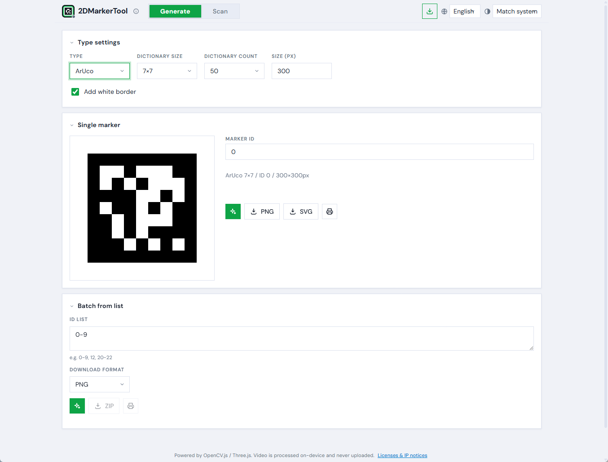
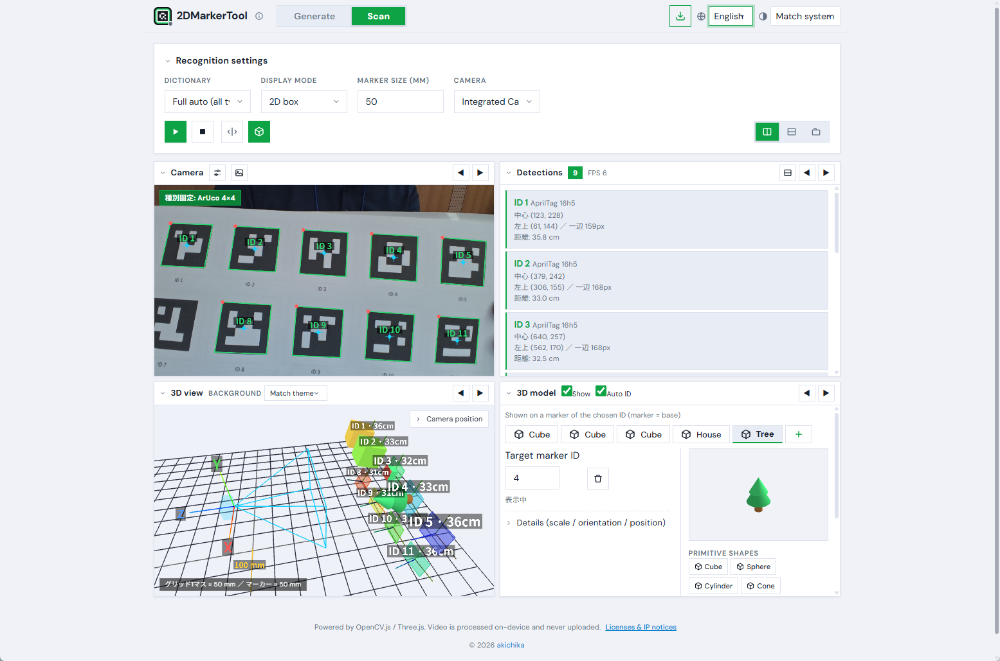

<div align="center">


# 2DMarkerTool

**2D marker generator & verifier**

**Generate** ArUco / AprilTag / QR / barcodes and **recognize them live** with your camera — 3D pose, a 3D world view, and AR model overlay — all entirely in the browser.

[](LICENSE)


🌐 **Live**: https://akichika.github.io/2DMarkerTool/ ・ 🇯🇵 **日本語**: [README.md](README.md)

</div>

> Video is processed entirely on-device and never uploaded. No build step, no package dependencies — plain HTML/CSS/JS.




---

## Features

- 🧩 **Marker generation**: ArUco (4×4–7×7, 50/100/250/1000 + ORIGINAL) / AprilTag (16h5, 25h9, 36h10, 36h11) / QR / **1D barcodes (EAN/JAN/UPC/CODE128 …)**. PNG, **SVG**, print, **ZIP batch**
- 🎥 **Live recognition**: "Full auto" detects ArUco / AprilTag / QR / barcode automatically; locks the detected type for speed
- 🟩 **Display modes**: 2D box / fill + big ID / **3D pose (solvePnP + Three.js AR overlay)**
- 🌐 **3D world view**: relative pose of camera and markers in a separate CG canvas (OrbitControls, scale & distance labels, device-orientation follow)
- 🧊 **AR model overlay**: show a primitive shape or a glTF/OBJ model on a marker of a chosen ID — color, texture, **live 3D preview**, multiple tabs
- 🪄 **Flexible layout**: arrange Camera / Detections / 3D world / 3D model side-by-side, stacked, or as tabs; reorderable
- 🌗 **Themes**: System / Light / Dark / High-contrast　🌍 **i18n**: 日本語 / English / 中文 / Español
- 📱 **PWA**: installable, works offline (Service Worker)
- 🔆 **Low-light boost**: automatic / manual brightness & contrast

## Screenshots

| Recognition (2D box) | 3D pose (AR) | 3D world view | Model overlay setting |
|---|---|---|---|
|  |  |  |  |

## Usage

The browser's `getUserMedia` (camera) only works on **http://localhost or https**. Opening via `file://` breaks OpenCV.js and the camera, so serve it over a local server.

```bash
# In this folder (if you have Python)
python -m http.server 8000
# → open http://localhost:8000

# If you have Node
npx serve .
```

On phones you need HTTPS hosting or a tunnel (e.g. ngrok).

### Install (PWA)
- Chrome / Edge: install icon in the address bar, or the install button at the top-right
- Safari (iOS): Share menu → "Add to Home Screen"
- After install, the Service Worker lets it **launch offline**

## Tips for reliable recognition
- Generate markers **with a white quiet zone** and place them on a **white background** (paper) for best stability
- Keep them in focus, fully in frame, and not at an extreme angle
- For QR/JAN, move closer and avoid blur; in low light, raise brightness/contrast with the adjustment sliders

## How it works
- ArUco/AprilTag via OpenCV `cv.aruco_ArucoDetector` / `generateImageMarker` (`DICT_*` enums)
- QR: generated with qrcode-generator, detected with `cv.QRCodeDetector`. 1D barcode: generated with JsBarcode, detected with `cv.barcode_BarcodeDetector`
- Pose: `cv.solvePnP` (`SOLVEPNP_IPPE_SQUARE`; `IPPE` for barcodes) + `cv.Rodrigues`; OpenCV → Three.js with y,z flip
- "Full auto" alternates ArUco/AprilTag when unlocked, locks the detected type afterwards, and alternates QR/barcode for speed
- Language, theme, layout and background are saved in `localStorage`

## Project files
- `index.html` / `style.css` / `i18n.js` / `app.js` — the app
- `manifest.json` / `sw.js` / `icon-*.png` — PWA
- `generate_icons.py` — icon (logo) generator (Pillow)
- `docs/` — screenshots, articles, capture guide

## License & IP notices
- This software: [MIT License](LICENSE) © akichika
- Libraries: OpenCV.js (Apache-2.0) / Three.js (MIT) / JSZip (MIT/GPLv3) / qrcode-generator (MIT) / JsBarcode (MIT)
- **AprilTag**: tag families © AprilRobotics / University of Michigan (BSD 2-Clause). Generated tags are free to use.
- **QR Code**: "QR Code" is a registered trademark of **DENSO WAVE INCORPORATED**. The spec (ISO/IEC 18004) is open and royalty-free; generated images are free to use.

## Credits
Author: **akichika** — https://x.com/akichika

Pull requests welcome. Please file feedback, bug reports and suggestions in [Issues](https://github.com/akichika/2DMarkerTool/issues).
