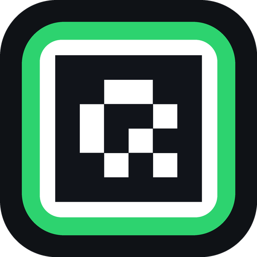
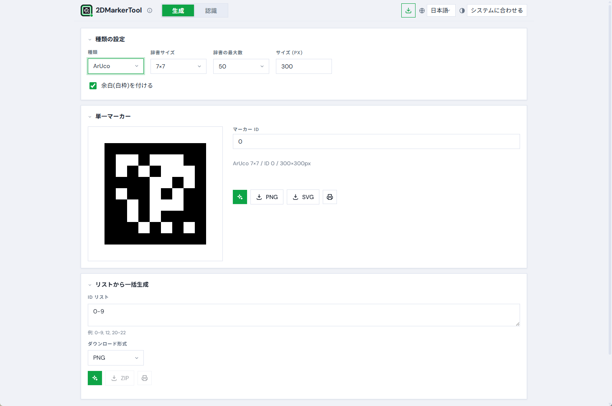
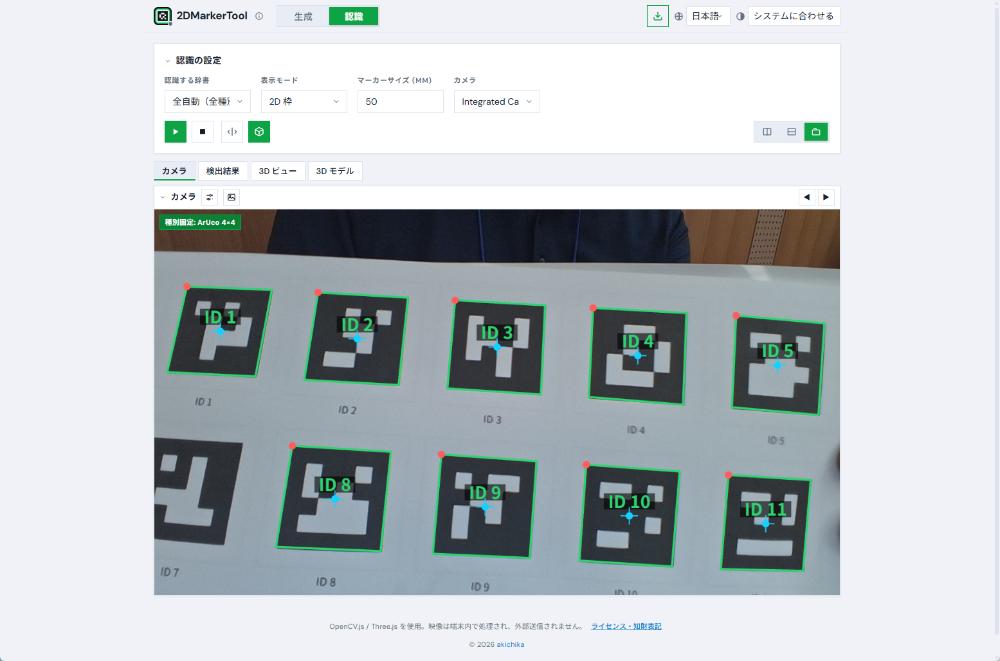
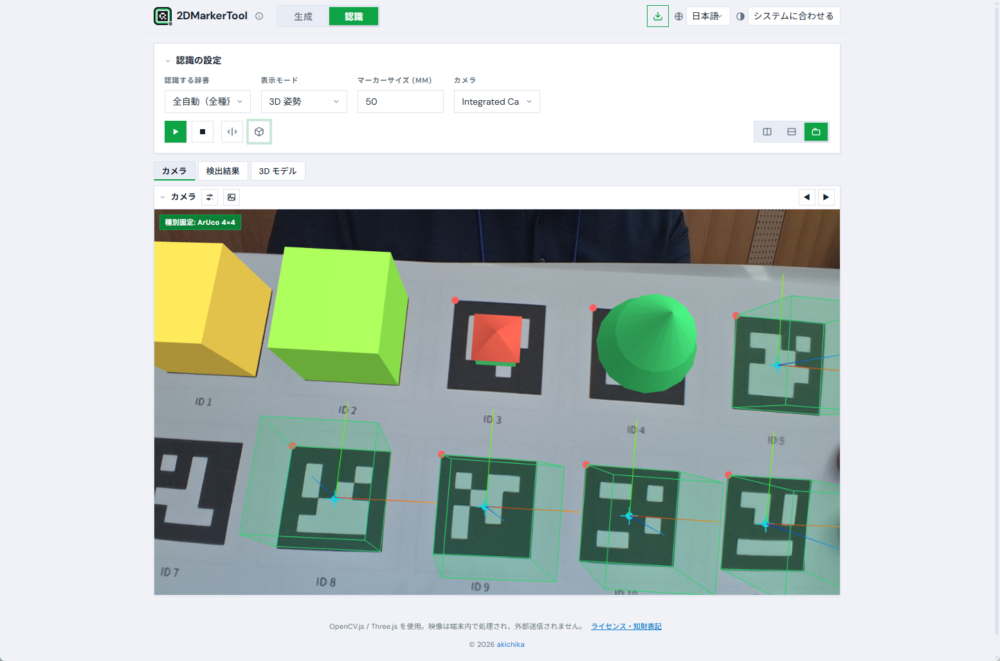
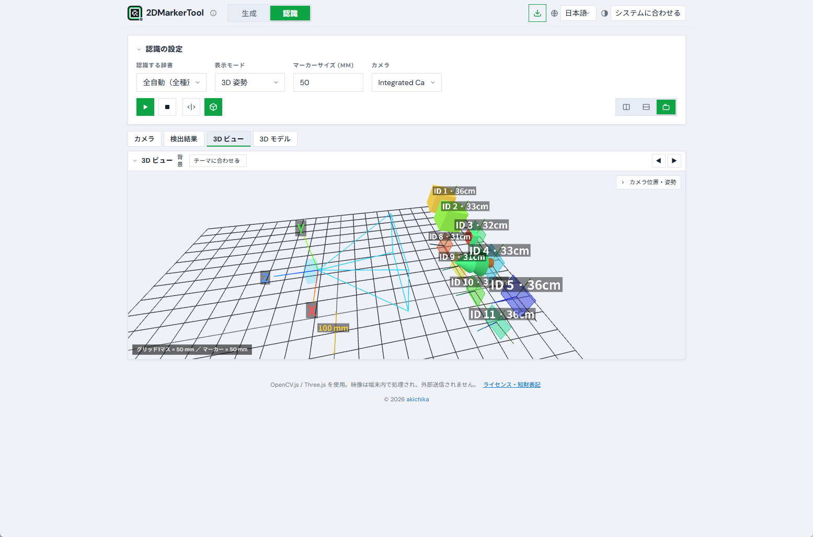

<div align="center">



# 2DMarkerTool

**二次元マーカー生成・確認ツール**

ArUco / AprilTag / QR / バーコード の **生成** と、カメラによる **リアルタイム認識・3D姿勢・3Dワールド・ARモデル重畳** を、すべてブラウザ内で完結。

[](LICENSE)


🌐 **公開サイト**: https://akichika.github.io/2DMarkerTool/ ・ 🇬🇧 **English**: [README.en.md](README.en.md)

</div>

> 映像はすべて端末内で処理され、外部に送信されません。ビルド不要・依存パッケージ不要の素の HTML/CSS/JS です。



---

## 特長

- 🧩 **マーカー生成**: ArUco（4×4〜7×7・各50/100/250/1000＋ORIGINAL）/ AprilTag（16h5・25h9・36h10・36h11）/ QR / **1Dバーコード（JAN/EAN/UPC/CODE128 等）**。PNG・**SVG**・印刷・**ZIP一括**
- 🎥 **リアルタイム認識**: 「全自動（全種別）」で ArUco / AprilTag / QR / バーコードを自動判別。種別固定で高速化
- 🟩 **表示モード**: 2D枠 / 塗りつぶし＋大ID / **3D姿勢（solvePnP＋Three.js のAR重畳）**
- 🌐 **3Dワールドビュー**: カメラと各マーカーの相対的な位置姿勢を別キャンバスに CG 表示（OrbitControls・スケール・距離ラベル・デバイス姿勢追従）
- 🧊 **3Dモデル重畳**: 指定 ID のマーカー上にプリミティブ形状／glTF・OBJ モデルを表示。色指定・テクスチャ・**ライブ3Dプレビュー**・複数タブ
- 🪄 **柔軟レイアウト**: カメラ／検出結果／3Dワールド／3Dモデルを横・縦・タブで自由配置、並べ替え可
- 🌗 **テーマ**: システム / ライト / ダーク / ハイコントラスト　🌍 **多言語**: 日本語 / English / 中文 / Español
- 📱 **PWA**: インストール可能・オフライン動作（Service Worker）
- 🔆 **低照度補正**: 明るさ・コントラストの自動／手動調整

## スクリーンショット

| 認識（2D枠） | 3D姿勢（AR） | 3Dワールドビュー |
|---|---|---|
|  |  |  |

| 3Dモデル重畳＋プレビュー | QR/バーコード デコード | 柔軟レイアウト |
|---|---|---|
|  |  |  |

## 使い方

ブラウザの `getUserMedia`（カメラ）は **http://localhost または https** でのみ動作します。`file://` で直接開くと OpenCV.js とカメラが正しく動かないため、ローカルサーバー経由で開いてください。

```bash
# このフォルダで（Python がある場合）
python -m http.server 8000
# → ブラウザで http://localhost:8000 を開く

# Node がある場合
npx serve .
```

スマホで使う場合は https 配信か、PC とのトンネル（ngrok 等）が必要です。

### インストール（PWA）
- Chrome / Edge: アドレスバーのインストールアイコン、または画面右上のインストールボタンから
- Safari（iOS）: 共有メニュー →「ホーム画面に追加」
- インストール後は Service Worker により**オフラインでも起動**します

## 認識のコツ
- マーカーは**白い余白（クワイエットゾーン）付き**で生成し、**白い背景（紙など）**に置くと最も安定します
- ピントが合い、マーカー全体が画面内に入り、極端な斜めでないこと
- QR/JAN はカメラに近づけ、ぶれないように。暗い場合はヘッダー付近の調整スライダーで明るさ・コントラストを上げる

## 技術メモ
- ArUco/AprilTag: OpenCV の `cv.aruco_ArucoDetector` / `generateImageMarker`（`DICT_*` 列挙）
- QR: 生成 = qrcode-generator、検出 = `cv.QRCodeDetector`。1D バーコード: 生成 = JsBarcode、検出 = `cv.barcode_BarcodeDetector`
- 姿勢推定: `cv.solvePnP`（`SOLVEPNP_IPPE_SQUARE` / バーコードは `IPPE`）＋ `cv.Rodrigues`。OpenCV座標 → Three.js へ y,z 反転
- 「全自動」は未検出時に ArUco/AprilTag を交互走査、検出後は種別固定、QR/バーコードは交互実行で高速化
- 言語・テーマ・レイアウト・背景は `localStorage` に保存

## ファイル構成
- `index.html` / `style.css` / `i18n.js` / `app.js` — 本体
- `manifest.json` / `sw.js` / `icon-*.png` — PWA
- `generate_icons.py` — アイコン（ロゴ）生成スクリプト（Pillow）
- `docs/` — スクリーンショット・記事・撮影ガイド

## ライセンス・知財表記
- 本ソフトウェア: [MIT License](LICENSE) © akichika
- ライブラリ: OpenCV.js (Apache-2.0) / Three.js (MIT) / JSZip (MIT・GPLv3) / qrcode-generator (MIT) / JsBarcode (MIT)
- **AprilTag**: タグファミリーは © AprilRobotics / University of Michigan（BSD 2-Clause）。生成タグは自由に利用可
- **QR Code**: 「QR Code」は **DENSO WAVE INCORPORATED の登録商標**です。規格 (ISO/IEC 18004) は公開・ロイヤリティフリーで、生成画像は自由に利用できます

## クレジット
作者: **akichika** — https://x.com/akichika

Pull Request 歓迎。フィードバック・バグレポート・提案は [Issues](https://github.com/akichika/2DMarkerTool/issues) へお願いします。
