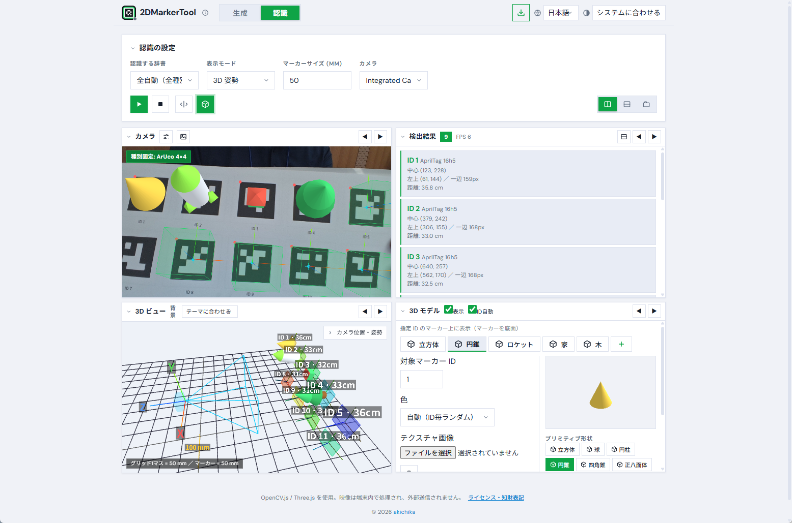
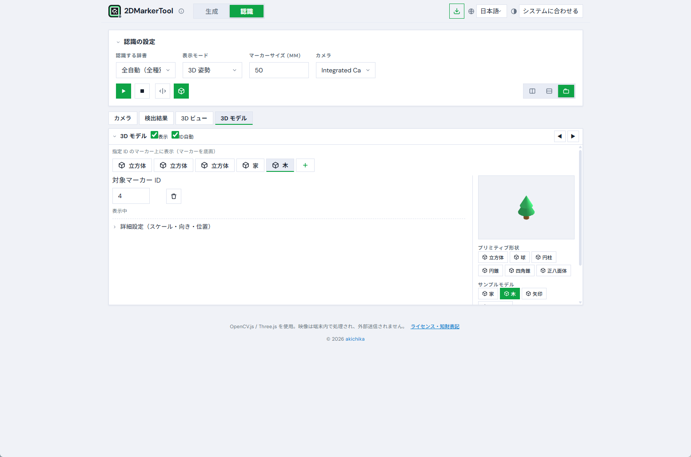

<div align="center">


# 2DMarkerTool

二次元マーカー生成・確認ツール

</div>

ArUco / AprilTag / QR / バーコードを生成し、カメラで認識して位置や姿勢を確かめるための小さなツールです。OpenCV.js と Three.js を使い、処理はすべてブラウザの中だけで行います。サーバーへのアップロードはありません。

[](LICENSE)


公開サイト: https://akichika.github.io/2DMarkerTool/ ／ English: [README.en.md](README.en.md)

> カメラ映像は端末内だけで処理され、外部には送信しません。ビルドや依存パッケージはなく、素の HTML / CSS / JS だけで動きます。





## 作った理由

AR やロボットの位置合わせで ArUco や AprilTag を使うとき、マーカーを作る・印刷する・きちんと認識されるか確かめる、という地味な往復作業を、毎回別々のツールでやっていました。手元でさっと済ませたかったので、生成から確認までを一画面にまとめ、ブラウザだけで動くものを書きました。特別なことはしておらず、既存のライブラリを素直につないだ程度のものです。

## できること

- **生成**: ArUco（4×4〜7×7）、AprilTag、QR、1D バーコード（JAN/EAN/UPC など）。PNG・SVG・印刷・ZIP 一括に対応します。
- **認識**: 「全自動」で種類を自動判別。表示は 2D 枠 / 塗りつぶし＋ID / 3D 姿勢（`solvePnP` による AR 重畳）から選べます。
- **3D ビュー**: カメラと各マーカーの位置関係を立体で確認できます。マウスで視点を動かせ、対応端末では本体の傾きにも追従します。
- **AR モデル重畳**: 指定した ID のマーカーの上に、立方体などのプリミティブや、読み込んだ glTF / OBJ を底面合わせで置けます。色やテクスチャも指定できます。
- **一時停止・静止画読み込み**: 映像を止めた画面や、手元の画像ファイルからも認識できます。静止フレームでは数回認識して多数決を取り、結果を安定させています。
- **その他**: 日本語 / 英語 / 中国語 / スペイン語、テーマ 4 種、PWA（インストール・オフライン動作）、暗所向けの明るさ・コントラスト補正。

| 認識（2D 枠） | 3D 姿勢 | 3D ビュー | AR モデル設定 |
|---|---|---|---|
|  |  |  |  |


## 使い方

カメラ（`getUserMedia`）は `http://localhost` か `https` でのみ動きます。`file://` で直接開くと OpenCV.js とカメラがうまく動かないので、ローカルサーバー経由で開いてください。

```bash
# Python があれば
python -m http.server 8000
# → http://localhost:8000 を開く

# Node があれば
npx serve .
```

スマートフォンで使う場合は https 配信か、PC とのトンネル（ngrok など）が要ります。

インストール（PWA）は、Chrome / Edge ならアドレスバーのアイコンか右上のボタンから、Safari（iOS）なら共有メニューの「ホーム画面に追加」から行えます。一度入れておくと、Service Worker により次回からオフラインでも起動します。

## 認識のコツ

- マーカーは白い余白（クワイエットゾーン）付きで生成し、白い紙などに置くと安定します。
- ピントを合わせ、マーカー全体を画面に入れ、極端な角度を避けてください。
- QR や JAN は近づけてブレを抑えると読みやすくなります。暗いときはヘッダー付近のスライダーで明るさ・コントラストを上げてみてください。

## 仕組み（簡単に）

- ArUco / AprilTag は OpenCV の `cv.aruco_ArucoDetector` と `generateImageMarker`（`DICT_*` 列挙）を使っています。
- QR は生成に qrcode-generator、検出に `cv.QRCodeDetector`。1D バーコードは生成に JsBarcode、検出に `cv.barcode_BarcodeDetector` を使います。
- 姿勢推定は `cv.solvePnP`（`SOLVEPNP_IPPE_SQUARE`、バーコードは矩形なので `IPPE`）＋ `cv.Rodrigues`。OpenCV の座標系を Three.js へ y, z 反転して渡しています。
- 「全自動」は、未検出のときに ArUco と AprilTag を 1 フレームおきに交互走査し、見つかったら種別を固定、QR とバーコードはフレームごとに交互実行して負荷を抑えています。
- 言語・テーマ・レイアウト・背景は `localStorage` に保存します。

## ファイル構成

- `index.html` / `style.css` / `i18n.js` / `app.js` — 本体
- `manifest.json` / `sw.js` / `icon-*.png` — PWA 関連
- `generate_icons.py` — アイコン生成スクリプト（Pillow）
- `docs/` — スクリーンショット、記事、撮影ガイド

## ライセンス

- 本ソフトウェア: [MIT License](LICENSE)
- ライブラリ: OpenCV.js (Apache-2.0) / Three.js (MIT) / JSZip (MIT・GPLv3) / qrcode-generator (MIT) / JsBarcode (MIT)
- **AprilTag**: タグファミリーは © AprilRobotics / University of Michigan（BSD 2-Clause）。生成したタグは自由に使えます。
- **QR Code**: 「QR Code」は DENSO WAVE INCORPORATED の登録商標です。規格（ISO/IEC 18004）は公開・ロイヤリティフリーで、生成した画像は自由に使えます。

## 作者・連絡先

田中章愛（akichika） — https://x.com/akichika

不具合の報告や提案は [Issues](https://github.com/akichika/2DMarkerTool/issues) へ、改善の Pull Request も歓迎します。
